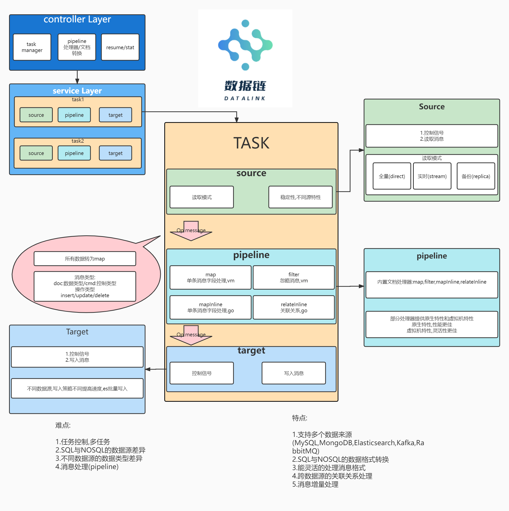

MySQL数据同步到ElasticSearch中,解决全文检索的解决方案.

优势:
- 业务代码零侵入,不需要额外的业务代码.
- 数据秒级同步.
- 使用简答.

### 实现

- MySQL的读写

## 项目结构

### /app

程序入口

```
-app
|---datalink
    |---main.go // 程序入口 
```

### /build

构建脚本,暂未使用

### /datalink

源码

```
-datalink
|---linkd // 提供web接口,控制任务等
|---loop  // 任务执行
|---terms // 对各种资源的读写实现
```

### /docs

文档目录,各任务配置说明以及**http**的**api**说明

### /examples

任务的示例

### /internal

内部定义常量等

### /linkadmin

目前为web控制台,debug使用

### /runtime

任务文件,运行时临时文件

### 程序结构

