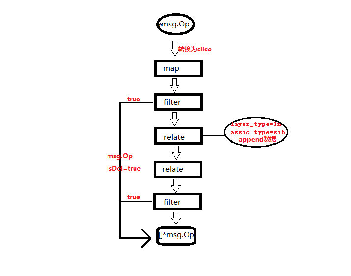

## pipeline 介绍

对于文档的提供删除字段,忽略字段,变更字段名称的功能

### 示例配置:

```json5
{
    "pipeline": [
        {
            "document_set": "database.document_set",
            "flow": [
                {
                    "type": "map",
                    "script": "module.exports=function(doc){doc.attr1=2022;return doc}"
                },
                {
                    "type": "filter",
                    "script": "module.exports=function(doc){return false;}"
                },
                {
                    "type": "mapInline",
                    "field_map": [
                        {
                            "srcField": "id",
                            "srcType": "long",
                            "aimField": "tab_id",
                            "aimType": "srcType"
                        },
                        {
                            "srcField": "code",
                            "srcType": "string",
                            "aimField": "tab_code",
                            "aimType": "string"
                        },
                        {
                            "srcField": "name",
                            "srcType": "string",
                            "aimField": "tab_name",
                            "aimType": "string"
                        }
                    ]
                },
                {
                    "type": "relateInline",
                    "assoc_type": "11",
                    "source_id": "no1000001",
                    "relate_document_set": "datalink_foo.area_desc",
                    "layer_type": "sib",
                    "sub_label": "",
                    "field_map": {
                        "r.id": "area_desc_id"
                    },
                    "wheres": [
                        {
                            "src_field": "id",
                            "operator": "=",
                            "rel_field": "id"
                        }
                    ]
                },
                {
                    "type": "filter",
                    "script": "module.exports=function(doc){if(!!doc.area_desc_id){return false;}return true;}"
                }
            ]
        }
    ]
}
```

对单个文档做有序的处理,pipeline中的item即使执行顺序,如图:


## 四种flow

该部分提供四种flow: `map`, `filter`, `mapInline`, `relateInline`

- map,用于文档字段转换.
- filter,返回true就过滤掉文档,不在处理.
- mapInline,字段映射.
- relateInline,变换关联关系.

需要注意:

1. 执行顺序,pipeline配置中item顺序即为执行顺序,处理过程中向下流转文档.
2. 自定义函数时,需要注意冲突.flow中使用了[otto的VM](https://github.com/robertkrimen/otto),
   默认加载了js的underscore库, [underscore的说明](https://github.com/robertkrimen/otto/tree/master/underscore)

### map

对文档的编辑,比如新增字段,删除字段等.

```json5
{
    "type": "map",
    "script": "module.exports=function(doc){doc.attr1=2022;return doc;}"
}
```

```javascript
module.exports = function (doc) {
    doc.attr1 = 2022;
    return doc;
}
```

> 注意:删除时,doc文档中可能没有字段

### filter

是个过滤文档,返回false为继续处理;true文档则过滤掉文档,不再处理

```json
{
    "type": "filter",
    "script": "module.exports=function(doc){return doc.id>100;}"
}
```

```javascript
module.exports = function (doc) {
    return doc.id > 100;
}
```

### mapInline

字段映射,使用内部定义的规则,效率比map高.只是简单的字段转换,建议使用.

```json5
{
    "type": "mapInline",
    "field_map": [
        {
            "srcField": "id",
            "srcType": "long",
            "aimField": "tab_id",
            "aimType": "long"
        },
        {
            "srcField": "code",
            "srcType": "string",
            "aimField": "tab_code",
            "aimType": "string"
        },
        {
            "srcField": "name",
            "srcType": "string",
            "aimField": "tab_name",
            "aimType": "string"
        }
    ]
}
```

### relateInline

文档的关联关系处理,使用的是建立新连接方式,所以需要新建连接源为empty.

```json5
{
    "type": "relateInline",
    // 关联关系 
    "assoc_type": "11",
    // 一对一
    "source_id": "c888b053-45f3-4c98-b219-8acfe67999d1",
    // 关联资源id
    "script": "",
    // 脚本,暂时无效
    "relate_document_set": "database3.document_set",
    // 关联文档集,需要指定资源id
    "layer_type": "sib",
    // 层级关系:sib  sub
    "sub_label": "",
    // 层级关系为sub时,指定key
    "field_map": {
        // 层级关系为sib时,指定字段别名
        // 另外,设定field_map时,没有指定的字段都将被忽略
        // |之后为默认值,当value=nil时,有效
        // i为int,s为string,d为日期now或者时间戳,f为float
        "r.id": "area_desc_id|i:0",
        "s.name": "src_name|s:default_string",
        "s.created_at": "src_name|d:now",
        "s.fund": "src_name|f:0.0"
    },
    "wheres": [
        // 字段关联关系
        {
            "src_field": "id",
            "operator": "=",
            "rel_field": "id"
        }
    ]
}
```

- `source_id`指定数据来源,不设置则为doc读取数据源
- `script`使用脚本进行关联,和一般关联并不共存.暂时不支持
- `assoc_type`定义关联关系,值为: `11(一对一)`/`1n(一对多)`
- `relate_document_set`为关联文档集,在es中为mongodb的 `db.collection`
- `layer_type`为关联数据的层叠关系,值为: `sib(同级)`/`sub(子级)`
- `sub_label`当`layer_type=sub`时,指定子级在当前文档中的key
- `field_map`当`layer_type=sib`时,当前文档字段别名,`r.id`中的`r`指定`relate_document_set`,`s.name`为当前文档中的`name`
- `wheres`为条件关联,默认使用`src_field`与`rel_field`为相等的关系,`operator`暂时无效

## Otto虚拟机

### 注意:

js虚拟机otto不支持诸多浏览器的语法

- 只支持`var`定义变量
- 循环可用 `for in`
- js被压缩之后可能`js语法`识别错误
- 当心源数据类型中的`bigint`被`otto`忽略掉精度
- 引入了js函数库[underscore](http://underscorejs.org)

### 虚拟机的内置函数

> 在flow中使用script时,可直接使用内置函数

- ifnull 取默认值
    - function ifnull(value, default_value) mixed
- pad 拼接字符串
    - function pad(string,pad_char,number,direction) string
- trim 去掉空白字符
    - function trim(string) string
- startwith 检查字符串以指定字符开头
    - function startwith(string, prefix_string) string
- endwith 检查字符串以指定字符结尾
    - function endwith(string, suffix_string) boolean
- strtoupper 字符串大写
    - function strtoupper(string) string
- strtolower 字符串小写
    - function strtolower(string) string
- strrev 字符串翻转
    - function strrev(string) string
- strtotime 时间转时间戳(10位),
    - function strtotime(string) integer
- date 格式化时间,支持将10位时间戳转为Y-m-d,Y-m-d H:i:s格式数据
    - function date('Y-m-d', timestamp) string
- now 当前时间戳10位
    - function now() integer
- ceil 向上取整
    - ceil(float) integer
- floor 向下取整
    - floor(float) integer
- round 四舍五入
    - round(float) integer
- rand 随机数
    - rand(float) integer
- abs 绝对值
    - abs(integer) integer
- max 最大值
    - max(array) integer
    - max(value1, value2, ... ) integer
- min 最小值
    - min(array) integer
    - min(value1, value2, ... ) integer
- DocumentFind 从指定资源中查找唯一文档,目前只支持mysql
    - DocumentFind(id, documentSet, resourceID)
